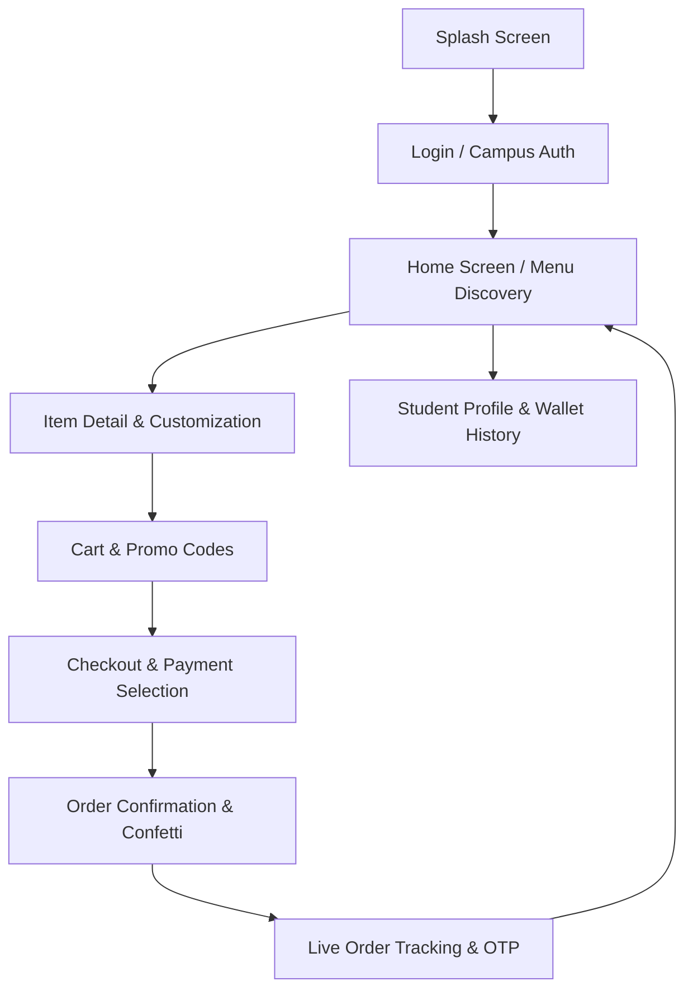

# 🍔 QuickBite — Smart University Canteen Food Pre-Ordering & Pickup System

<div align="center">


[](https://react.dev/)
[](https://vitejs.dev/)
[](https://github.com/pasindukarunadasa/QuickBite_IM_2023_060)
[](#)
[](#)

**A high-performance, mobile-first food ordering and queue-busting ecosystem designed for university campus canteens and student dining.**

[Explore Features](#-key-features) • [Screens Overview](#-screen-showcase--flows) • [Tech Stack](#-technology-stack) • [Getting Started](#-getting-started) • [Project Structure](#-project-structure)

</div>

---

## 📌 Executive Summary

**QuickBite** (`IM/2023/060`) is an end-to-end interactive mobile web application engineered to solve long queue bottlenecks and rush-hour delays in university cafeterias. It enables students and university staff to pre-order food, customize dietary requirements, schedule pickup times, pay seamlessly via digital campus wallets or cards, and track live kitchen preparation statuses with instant counter verification tokens (OTP / Barcodes).

---

## ✨ Key Features

### 🍱 1. Smart Menu & Dietary Discovery
- **Multi-Category Navigation**: Effortlessly explore *Main Meals*, *Beverages*, *Healthy Bowls*, *Snacks & Bakery*, and *Desserts*.
- **Real-Time Dietary Filters**: Filter items by *Vegetarian*, *Vegan*, *Halal*, *Gluten-Free*, and *Chef's Special*.
- **Live Search & Instant Suggestions**: Fast fuzzy search across dish names, ingredients, and counter locations.
- **Dynamic Pricing & Add-ons**: Customize portion sizes, add extra proteins, toppings, sides, and submit bespoke cooking notes.

### 🛒 2. Intelligent Cart & Campus Offers
- **Granular Customization Tracking**: Independent cart item configs with live subtotal breakdown.
- **Promo Code Engine**: Built-in promotional validation (e.g., `CAMPUS10`, `QUICKBITE20`, `FREESHIP`).
- **Pickup Slot Scheduling**: Choose between *Immediate Pickup (10–15 mins)* or future designated break times.
- **Counter Routing**: Automatic allocation of food items to specific canteen counters (Counter 1, Counter 2, Cafe Express).

### 💳 3. Multi-Channel Checkout & Campus Wallet
- **Campus Digital Wallet**: Instant checkout using student account balance with simulated reload options.
- **Multiple Payment Channels**: Support for University Student ID Card, Credit/Debit Cards, Google/Apple Pay, and Cash at Counter.
- **Tip & Packaging Options**: Customizable tip amounts and eco-friendly packaging preferences.

### ⏱️ 4. Real-time Order Tracking & OTP Pickup
- **Live Prep Pipeline**: Visual status bar cycling through `Order Placed` ➔ `Preparing in Kitchen` ➔ `Ready for Pickup` ➔ `Completed`.
- **Queue-Busting Digital Token**: Generates unique Order IDs, QR Codes, and 4-digit pickup OTPs for counter verification.
- **Live Countdown Timer**: Dynamic estimation of remaining cooking and packaging time.

### 👤 5. Student Profile & Order History
- **Personal Campus Dashboard**: View student credentials (`IM/2023/060`), enrolled faculty, and campus loyalty points.
- **One-Click Reorder**: Instant retrieval and re-ordering of favorite past meals.
- **Favorites & Wishlist**: Toggle favorites across dishes for quick single-tap access.
- **Persistent Local State**: State auto-syncs with browser `localStorage` across page reloads.

### 📱 6. Interactive Device Simulation Frame
- Built-in floating frame simulator toggleable between **iOS (iPhone style)** and **Android** styles.
- Support for rotation, zoom scaling, dynamic status bar, and desktop backdrop.

---

## 📱 Screen Showcase & Flows



| Screen | Purpose & Highlights |
|---|---|
| **Splash Screen** | Dynamic brand splash with greeting animations and fast entry. |
| **Login Screen** | Campus student credential input with pre-filled demo mode for instant testing. |
| **Home Screen** | Category pills, special banners, item search, dietary filters, counter badges, and rating cards. |
| **Item Detail** | Ingredient modifier checkboxes, spicy meter, portion size selector, and special request notes. |
| **Cart Screen** | Quantity stepper, promotional voucher redemption, estimated pickup counter badge, and cost breakdown. |
| **Checkout Screen**| Student wallet selection, payment options, scheduled pickup time slots, and order summary. |
| **Order Confirmation** | Canvas confetti celebration, digital order token generation, and direct tracking CTA. |
| **Order Tracking** | Step-by-step preparation progress indicator, counter pickup OTP, cancel/reorder actions. |
| **Profile Screen** | Student ID metadata, digital wallet balance top-up, re-order history, dietary preferences. |

---

## 🛠️ Technology Stack

- **Frontend Core**: [React 19](https://react.dev/) (Functional Components, Custom Context Hooks)
- **Build Tool & Bundler**: [Vite 8](https://vitejs.dev/) (Lightning-fast HMR and optimized production bundling)
- **Icons**: [Lucide React](https://lucide.dev/)
- **Micro-Animations & FX**: [Canvas Confetti](https://www.npmjs.com/package/canvas-confetti) & Pure CSS3 Keyframe Animations
- **State Management**: React Context API (`AppContext`) + `localStorage` persistence
- **Design System**: Vanilla CSS Design Tokens, Glassmorphism, Micro-interactions, and Mobile Device Simulator Frame

---

## 🚀 Getting Started

Follow these steps to run the project locally on your development machine:

### Prerequisites
- **Node.js**: Version `18.x` or higher installed ([Download Node.js](https://nodejs.org/))
- **npm** or **yarn** package manager

### 1. Clone the Repository
```bash
git clone https://github.com/pasindukarunadasa/QuickBite_IM_2023_060.git
cd QuickBite_IM_2023_060
```

### 2. Install Dependencies
```bash
npm install
```

### 3. Launch Development Server
```bash
npm run dev
```
Open your browser and navigate to `http://localhost:5173` (or the URL displayed in your terminal).

### 4. Build for Production
```bash
npm run build
npm run preview
```

---

## 📂 Project Structure

```plaintext
QuickBite_IM_2023_060/
├── public/                  # Static assets & icons
├── src/
│   ├── assets/              # Images, vector graphics, and media
│   ├── components/          # Reusable UI widgets
│   │   ├── DeviceFrame.jsx  # Mobile simulator wrapper & frame controls
│   │   ├── BottomNav.jsx    # Sticky navigation bar
│   │   └── Header.jsx       # Global header with search & notification counter
│   ├── context/
│   │   └── AppContext.jsx   # Global state (Cart, User, Orders, Modals, Promo engine)
│   ├── data/
│   │   └── menuData.js      # Menu catalog, categories, pricing, counters, promo codes
│   ├── screens/             # Dedicated screen views
│   │   ├── SplashScreen.jsx
│   │   ├── LoginScreen.jsx
│   │   ├── HomeScreen.jsx
│   │   ├── ItemDetailScreen.jsx
│   │   ├── CartScreen.jsx
│   │   ├── CheckoutScreen.jsx
│   │   ├── OrderConfirmationScreen.jsx
│   │   ├── OrderTrackingScreen.jsx
│   │   └── ProfileScreen.jsx
│   ├── App.jsx              # Main App screen router
│   ├── App.css              # Device frame layout styles
│   ├── index.css            # Global theme variables, typography, and utility classes
│   └── main.jsx             # React DOM entry point
├── TEST_CASES_REPORT.md     # Comprehensive QA & Test Case Documentation
├── package.json             # Project dependencies & scripts
├── vite.config.js           # Vite build configuration
└── README.md                # Project documentation
```

---

## 🧪 Testing & Quality Assurance

Comprehensive QA test cases covering navigation, cart calculation, promotion discounts, validation states, and edge cases have been documented in [`TEST_CASES_REPORT.md`](./TEST_CASES_REPORT.md).

---

## 👨‍💻 Author & Attribution

- **Developer**: Pasindu Karunadasa
- **Student ID**: `IM/2023/060`
- **Coursework / Project**: Interactive Food Ordering System for University Canteens
- **Repository**: [https://github.com/pasindukarunadasa/QuickBite_IM_2023_060](https://github.com/pasindukarunadasa/QuickBite_IM_2023_060)

---

<div align="center">
  <sub>Built with ❤️ for hassle-free university dining.</sub>
</div>
